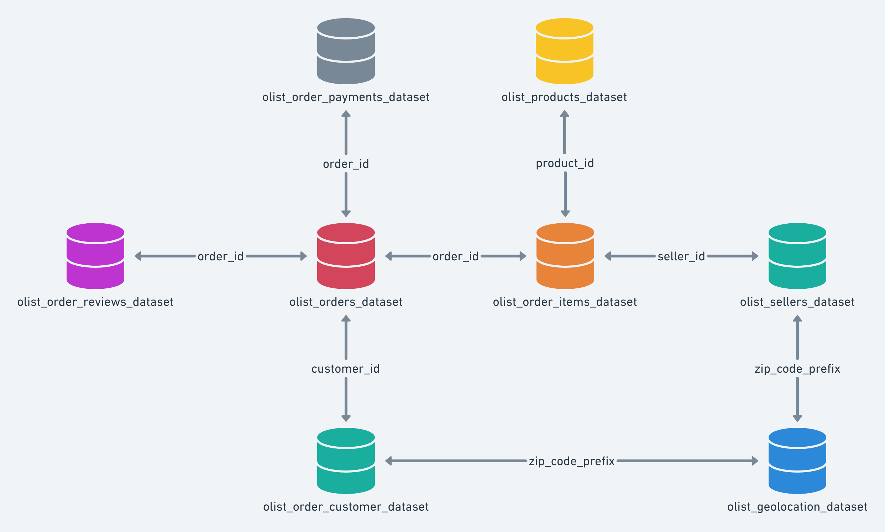
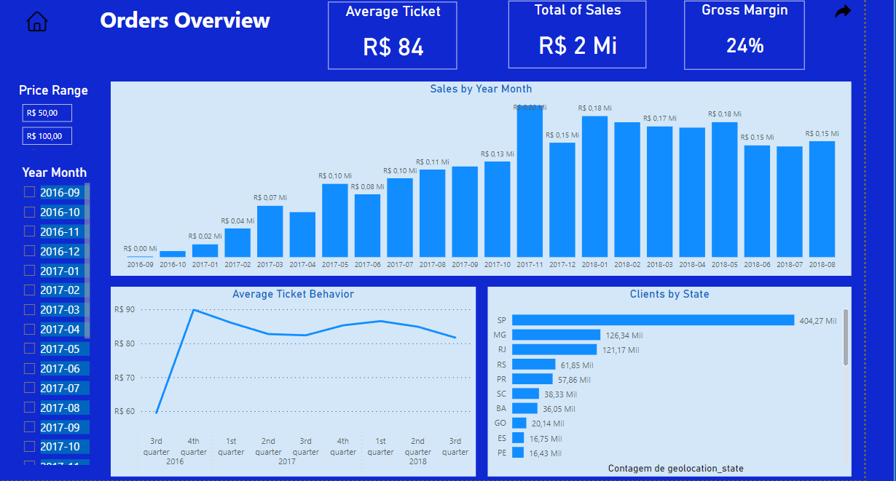
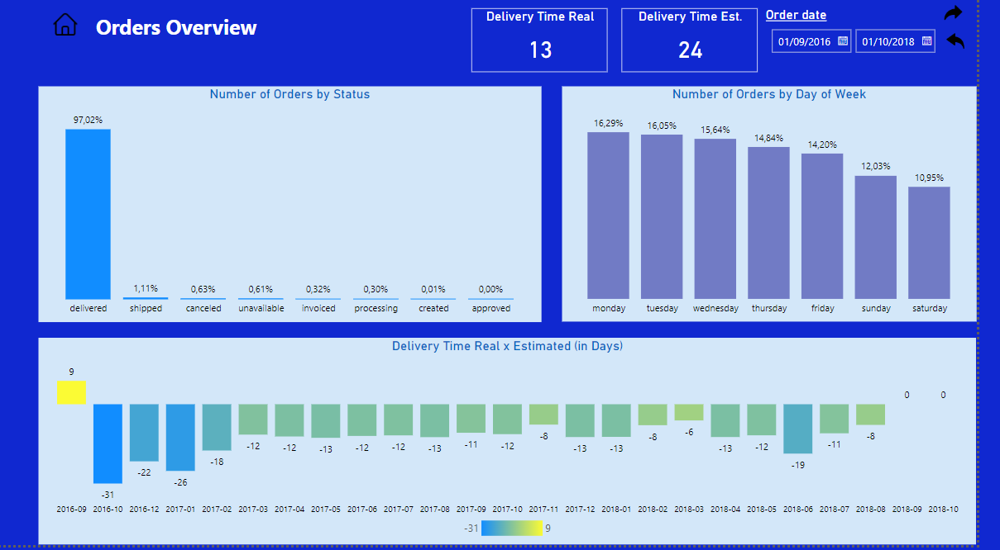
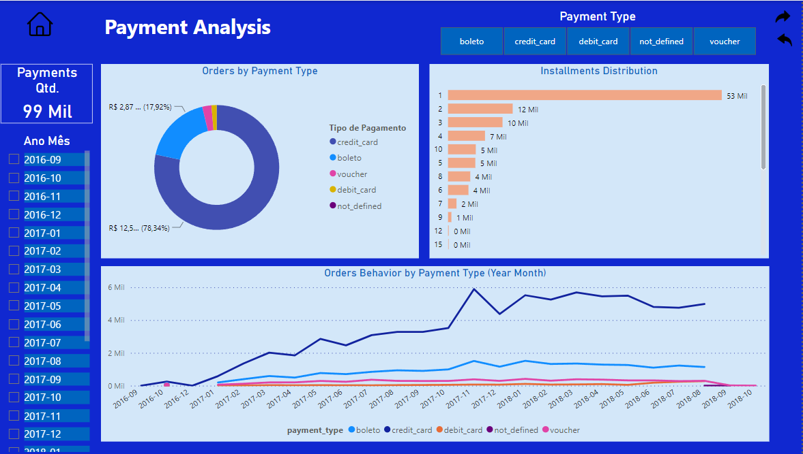
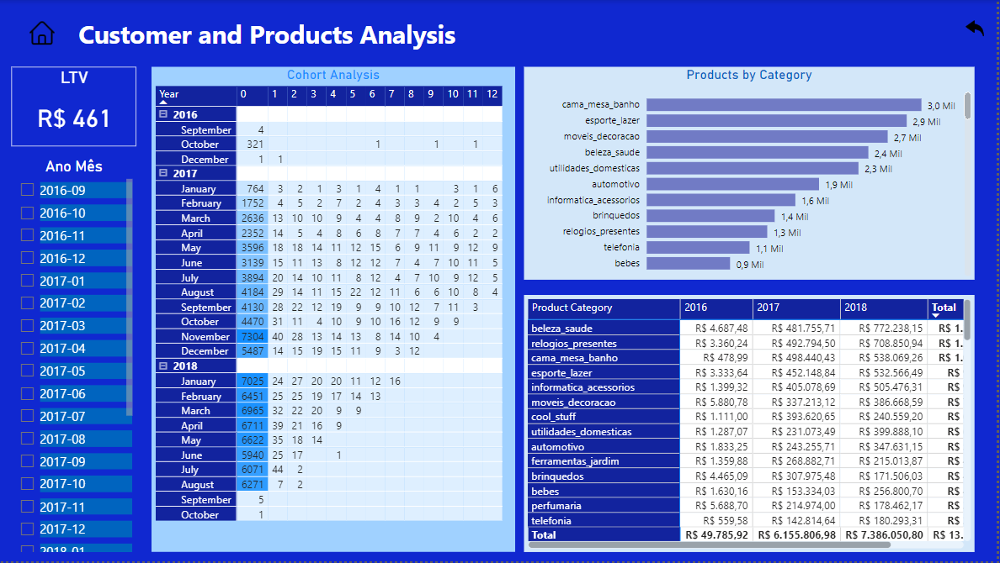

## 1 - Business Problem

 
Olist is a platform that connects vendors who wish to sell their products on major marketplaces with the end consumer. The company aggregates these products in a single store, visible to the market. A vendor from Olist has requested a report to provide them with a general business context to support decision-making. The data comes from the Olist platform and is represented in the following diagram:

One of these vendors, asked me to design a report to give him a general context about the business to support decision making. The data commes from the olist platform and is disposed as shown in the following diagram:

## 2 - Premises

The premisses used for this project are:

1. The data compreends the period between sep/16 and oct/18. 
2. The data compreends orders, customer, products and payments matters.

## 3 - Solution Strategy

The solution leverages Power BI for report creation and SQL language for data querying. Four different views have been created to provide a comprehensive business context:

1. Order Items View: Includes metrics such as clients by state, average ticket price, total gross margin of sales, average ticket price behavior, and sales by year and month.
2. Orders View: Involves metrics such as the number of orders by status, number of orders by day of the week, and delivery time actual versus estimated in days.
3. Payments View: Encompasses metrics such as orders by payment type, distribution of installments, and orders behavior by payment type in each month.
4. Customer and Products View: Contains metrics like cohort analysis, products by category, and amount sold by product category each year.

The four views are depicted in the images below:

Alt text

## 4 - Final Product

The most valuable findings are:

1. The average ticket price remained stable between BRL 80 and BRL 90 from 2016 to 2018. There was a sales peak in November 2017, possibly due to the Black Friday campaign.
2. Payments are typically made in a single installment, which could be attributed to the low average ticket price mentioned earlier. 
3. Customer churn is high. Observing the cohort analysis, it is evident that customers do not return to make purchases after the initial month of purchase. This behavior may be related to the insight regarding single installment payments. Implementing strategic emails, promotional alerts, vouchers, and other marketing approaches may help address this situation.

## 5 - Conclusion

The report successfully met the goal of providing a business context, and valuable insights were derived from it.

## 6 - Next Steps

As a next step for this project or others, data from the sales could be joined with marketing funnel data to gain further insights and make more informed decisions.