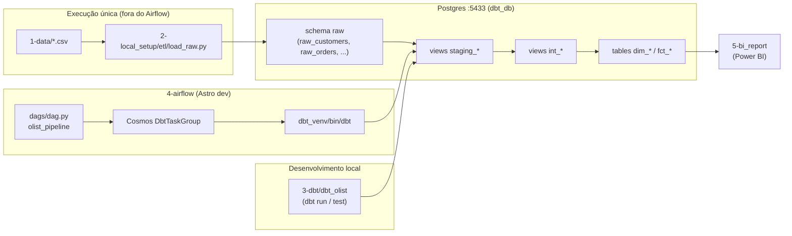
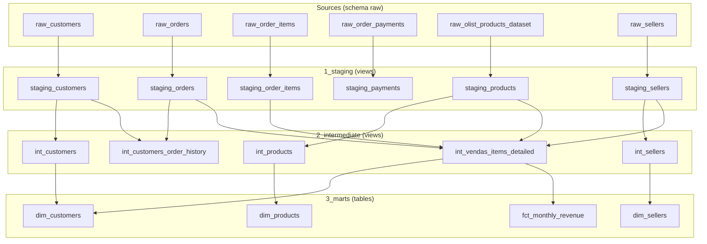
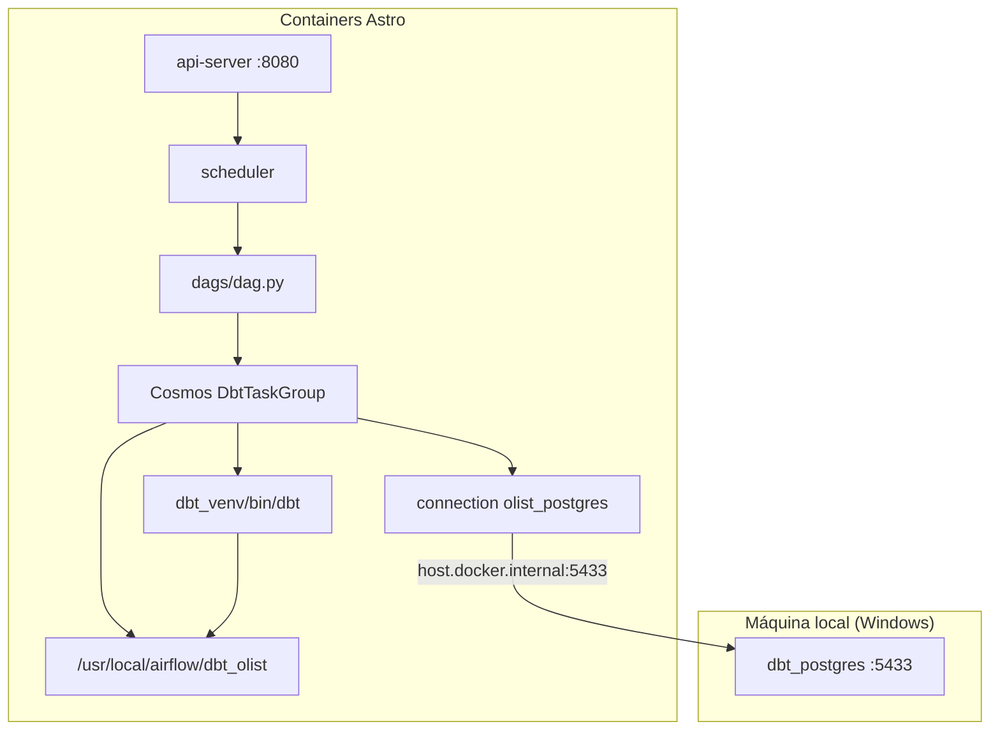

# Setup do projeto Olist — documentação detalhada

Este documento descreve como o monorepo foi estruturado, o papel de cada pasta/arquivo e como **dbt**, **Airflow** e **Postgres** se conectam.

---

## Visão geral do fluxo de dados



| Etapa | Onde roda | O que faz |
|-------|-----------|-----------|
| **Ingestão** | `2-local_setup` (manual, 1x) | CSV → schema `raw` |
| **Transformação (dev)** | `3-dbt` | `dbt run` / `dbt test` no terminal |
| **Transformação (agendada)** | `4-airflow` | DAG `olist_pipeline` via Cosmos |
| **Consumo** | `5-bi_report` | Dashboard Power BI |

---

## Estrutura de pastas do monorepo

```text
olist_project/
├── 1-data/                    # CSVs brutos da Olist (entrada do ETL)
├── 2-local_setup/             # Infra local: Postgres + ETL de ingestão
├── 3-dbt/                     # Projeto dbt (fonte da verdade dos modelos)
│   └── dbt_olist/
├── 4-airflow/                 # Orquestração com Astro + Cosmos
│   ├── dags/
│   ├── dbt_olist/             # Cópia espelhada de 3-dbt/dbt_olist
│   └── ...
├── 5-bi_report/               # Relatório Power BI (.pbix)
├── docs/                      # Esta documentação
└── .github/workflows/         # CI (dbt no GitHub Actions)
```

---

## 1. `1-data/` — dados brutos

| Arquivo | Origem | Destino no Postgres |
|---------|--------|---------------------|
| `tb_customers.csv` | Olist | `raw.raw_customers` |
| `tb_orders.csv` | Olist | `raw.raw_orders` |
| `tb_order_items.csv` | Olist | `raw.raw_order_items` |
| `tb_order_payments.csv` | Olist | `raw.raw_order_payments` |
| `tb_sellers.csv` | Olist | `raw.raw_sellers` |
| `olist_products_dataset.csv` | Olist | `raw.raw_olist_products_dataset` |

**Relação:** lidos apenas pelo script `2-local_setup/etl/load_raw.py`. O Airflow **não** recarrega CSVs — a ingestão é feita uma única vez.

---

## 2. `2-local_setup/` — infraestrutura local

Responsável por subir o Postgres e rodar a ingestão inicial.

### Estrutura

```text
2-local_setup/
├── docker-compose.yml    # Container Postgres (porta 5433 no host)
├── .env                  # Credenciais (DBT_USER, DBT_HOST, etc.) — não versionado
├── pyproject.toml        # Dependências Python (dbt, pandas, sqlalchemy)
├── uv.lock               # Lock do uv
└── etl/
    ├── __init__.py
    └── load_raw.py       # Script de ingestão CSV → schema raw
```

### Arquivos e propósito

| Arquivo | Propósito | Conecta com |
|---------|-----------|-------------|
| `docker-compose.yml` | Sobe `dbt_postgres` (Postgres 16) na porta **5433** | `.env` (user/senha), volume `postgres_data` |
| `.env` | Variáveis `DBT_*` usadas pelo ETL e pelo dbt local | `load_raw.py`, `~/.dbt/profiles.yml` ou profiles local |
| `pyproject.toml` | Define `dbt-core`, `dbt-postgres`, `pandas`, etc. | `uv sync` para ambiente local |
| `etl/load_raw.py` | Lê `../1-data/*.csv` e grava em `raw.*` | Postgres `:5433`, schema `raw` |

### Como subir

```bash
cd 2-local_setup
docker compose --env-file .env up -d          # Postgres
uv sync                                       # ambiente Python
uv run python -m etl.load_raw                 # ingestão (1x)
```

### Schemas no Postgres após ingestão + dbt

| Schema / objeto | Camada | Materialização |
|-----------------|--------|----------------|
| `raw.raw_*` | Bruto (ETL) | Tabelas |
| `public.staging_*` | Staging (dbt) | Views |
| `public.int_*` | Intermediate (dbt) | Views |
| `public.dim_*`, `public.fct_*` | Marts (dbt) | Tabelas |

---

## 3. `3-dbt/` — projeto dbt (fonte da verdade)

O dbt transforma `raw.*` → staging → intermediate → marts. É aqui que você **desenvolve e testa** modelos antes de espelhar no Airflow.

### Estrutura

```text
3-dbt/
└── dbt_olist/
    ├── dbt_project.yml           # Config global do projeto
    ├── models/
    │   ├── 1_staging/            # Limpeza e padronização
    │   │   ├── src_olist.yml     # Declara sources (raw.*) + testes
    │   │   ├── staging_customers.sql
    │   │   ├── staging_orders.sql
    │   │   ├── staging_order_items.sql
    │   │   ├── staging_payments.sql
    │   │   ├── staging_products.sql
    │   │   └── staging_sellers.sql
    │   ├── 2_intermediate/       # Joins e enriquecimento
    │   │   ├── intermediate.yml  # Documentação + testes
    │   │   ├── int_customers.sql
    │   │   ├── int_products.sql
    │   │   ├── int_sellers.sql
    │   │   ├── int_customers_order_history.sql
    │   │   └── int_vendas_items_detailed.sql
    │   └── 3_marts/              # Dimensões e fatos para BI
    │       ├── marts.yml
    │       ├── dim_customers.sql
    │       ├── dim_products.sql
    │       ├── dim_sellers.sql
    │       └── fct_monthly_revenue.sql
    └── logs/                     # Gerado ao rodar dbt (não versionar)
```

### Grafo de dependências entre modelos



### Arquivos-chave

| Arquivo | Propósito | Relacionamento |
|---------|-----------|----------------|
| `dbt_project.yml` | Nome do projeto (`dbt_olist`), profile, materializações por pasta | Lido por `dbt run`; espelhado em `4-airflow/dbt_olist/` |
| `src_olist.yml` | Declara **sources** apontando para `raw.*` | Usado por `{{ source('olist', 'raw_customers') }}` nos `.sql` |
| `staging_*.sql` | Renomeia colunas, tipos, limpeza | `source()` → `ref('staging_*')` |
| `int_*.sql` | Joins entre staging | `ref('staging_*')` → `ref('int_*')` |
| `dim_*`, `fct_*` | Modelos finais para BI | `ref('int_*')` |
| `intermediate.yml`, `marts.yml` | Docs + testes de qualidade | dbt test |

### Profile dbt (conexão Postgres)

O profile `dbt_olist` **não fica no repo** (segurança). Configuração típica local em `~/.dbt/profiles.yml`:

```yaml
dbt_olist:
  target: dev
  outputs:
    dev:
      type: postgres
      host: localhost
      port: 5433
      user: postgres
      password: postgres
      dbname: dbt_db
      schema: public
      threads: 4
```

No Airflow, o Cosmos **não usa** `profiles.yml` — usa a connection `olist_postgres` (ver seção 4).

### Comandos locais

```bash
cd 3-dbt/dbt_olist
dbt debug          # valida conexão
dbt run            # materializa modelos
dbt test           # roda testes declarados nos .yml
dbt docs generate  # documentação
```

---

## 4. `4-airflow/` — orquestração (Astro + Cosmos)

Executa o **mesmo projeto dbt** de forma agendada, sem reingestão de CSVs.

### Estrutura

```text
4-airflow/
├── .astro/
│   └── config.yaml              # Nome do projeto Astro
├── dags/
│   ├── dag.py                   # DAG principal olist_pipeline
│   ├── .airflowignore           # Ignora exampledag.py
│   └── exampledag.py            # Exemplo do Astro (ignorado)
├── dbt_olist/                   # Espelho de 3-dbt/dbt_olist (sincronizar ao alterar)
├── Dockerfile                   # Imagem custom: venv com dbt
├── requirements.txt             # astronomer-cosmos
├── docker-compose.override.yml  # Monta dbt_olist + host.docker.internal
├── airflow_settings.yaml.example # Template da connection Postgres
├── airflow_settings.yaml        # Connection local (gitignored)
├── tests/dags/                  # Pytest de integridade da DAG
└── include/etl/load_raw.py      # Legado; não usado pela DAG atual
```

### Como os componentes se conectam



### Arquivos e propósito

| Arquivo | Propósito | Conecta com |
|---------|-----------|-------------|
| `dags/dag.py` | Define DAG `olist_pipeline` com `DbtTaskGroup` | Cosmos, connection, path dbt |
| `Dockerfile` | Base Astro Runtime 3.2 + venv `dbt_venv` | `execution_config.dbt_executable_path` |
| `requirements.txt` | `astronomer-cosmos==1.14.0` | Integração dbt ↔ Airflow |
| `docker-compose.override.yml` | Monta `./dbt_olist` no container; `host.docker.internal` | Hot-reload de modelos sem rebuild |
| `airflow_settings.yaml` | Connection `olist_postgres` → Postgres Olist | `PostgresUserPasswordProfileMapping` |
| `dbt_olist/` | Cópia do projeto dbt | Deve estar alinhada com `3-dbt/dbt_olist/` |

### Connection Airflow → Postgres

```yaml
# airflow_settings.yaml (local)
airflow:
  connections:
    - conn_id: olist_postgres      # ← usado em dag.py
      conn_type: postgres
      conn_host: host.docker.internal  # host Windows/Mac → container dbt_postgres
      conn_port: 5433
      conn_login: postgres
      conn_password: postgres
      conn_schema: dbt_db
```

O Cosmos traduz essa connection em profile dbt em runtime (`profile_name: dbt_olist`, `target: dev`, `schema: public`).

### DAG `olist_pipeline`

- **Schedule:** `@daily`
- **Tasks:** uma task por modelo/teste dbt (geradas automaticamente pelo Cosmos)
- **Ordem:** respeita `ref()` do dbt (staging → int → marts)
- **Não inclui:** carga de CSV (ingestão já feita)

### Comandos Astro

```bash
cd 4-airflow
cp airflow_settings.yaml.example airflow_settings.yaml   # 1ª vez
astro dev start          # UI http://localhost:8080
astro dev parse          # valida DAGs
astro dev pytest         # testes
astro dev restart        # após mudar Dockerfile ou requirements
astro dev stop
```

### Sincronização dbt ↔ Airflow

Ao alterar modelos em `3-dbt/dbt_olist/`, copie para `4-airflow/dbt_olist/` (ou mantenha um script de sync). O volume em `docker-compose.override.yml` reflete mudanças sem rebuild da imagem.

---

## 5. `5-bi_report/` — consumo

| Arquivo | Propósito |
|---------|-----------|
| `olist_report.pbix` | Dashboard Power BI conectado às tabelas `dim_*` / `fct_*` |
| `image*.png` | Screenshots do relatório |

---

## 6. CI — `.github/workflows/pipeline.yml`

Roda no GitHub Actions: sobe Postgres, executa ETL, escreve `profiles.yml` e roda `dbt run` + `dbt test`. Independente do Airflow local.

---

## Mapa de conexões resumido

| De | Para | Mecanismo |
|----|------|-----------|
| CSV | `raw.*` | `2-local_setup/etl/load_raw.py` |
| `raw.*` | `staging_*` | dbt `source()` |
| `staging_*` | `int_*` | dbt `ref()` |
| `int_*` | `dim_*` / `fct_*` | dbt `ref()` |
| Airflow DAG | dbt | Cosmos + `dbt_venv` |
| Airflow | Postgres Olist | Connection `olist_postgres` |
| dbt local | Postgres Olist | `profiles.yml` → `localhost:5433` |
| Marts | Power BI | Conexão direta ao Postgres |

---

## Ordem recomendada de setup (do zero)

1. `2-local_setup`: `docker compose up -d` + `uv run python -m etl.load_raw`
2. `3-dbt/dbt_olist`: configurar profile + `dbt run` + `dbt test`
3. `4-airflow`: `airflow_settings.yaml` + `astro dev start` + trigger `olist_pipeline`
4. `5-bi_report`: abrir `.pbix` apontando para Postgres

---

## Troubleshooting comum

| Sintoma | Causa provável | Solução |
|---------|----------------|---------|
| DAG “rodando” sem progresso | Execuções antigas com task `load_raw` falhando | Cancelar runs antigas; DAG atual só roda dbt |
| dbt falha em staging | Tabelas `raw.*` vazias ou ausentes | Rodar ingestão em `2-local_setup` |
| Airflow não conecta ao Postgres | `dbt_postgres` parado ou connection errada | `docker compose up -d` + revisar `airflow_settings.yaml` |
| Modelos desatualizados no Airflow | `4-airflow/dbt_olist` diverge de `3-dbt` | Sincronizar pastas |
